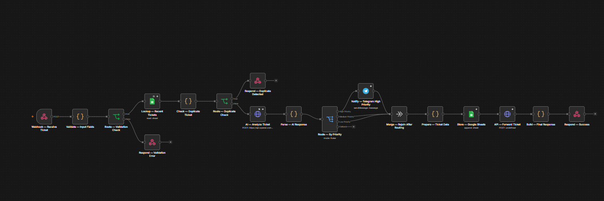
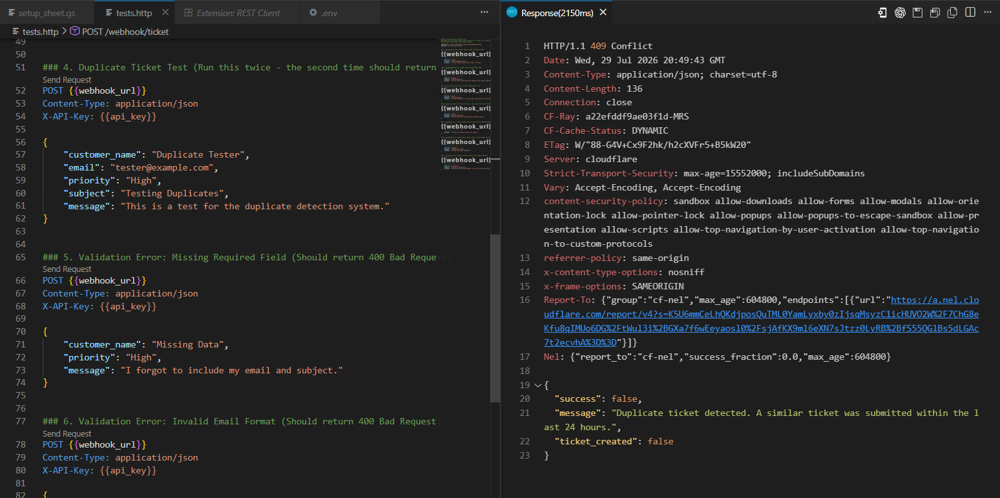
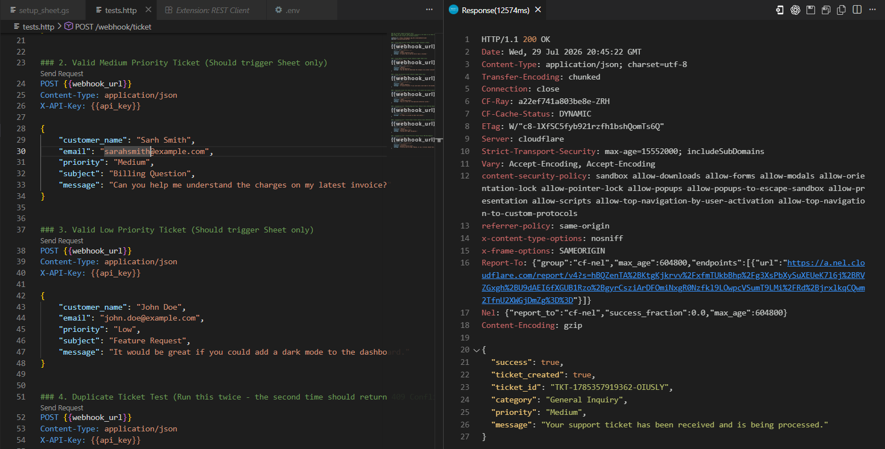
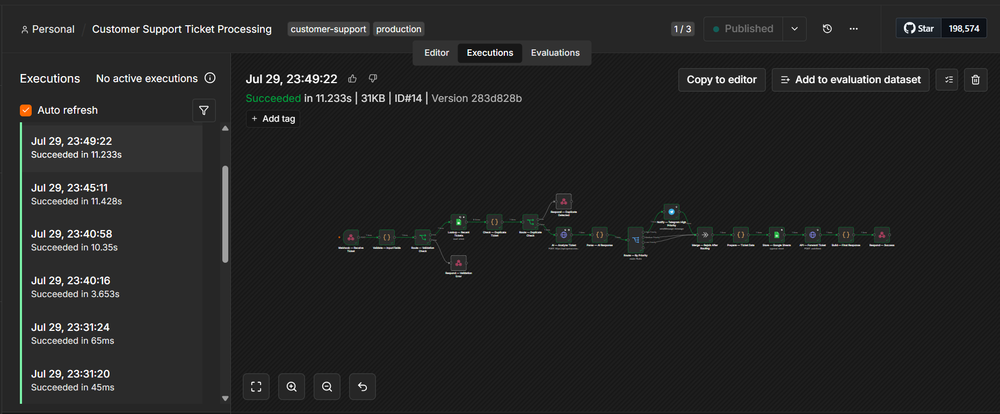
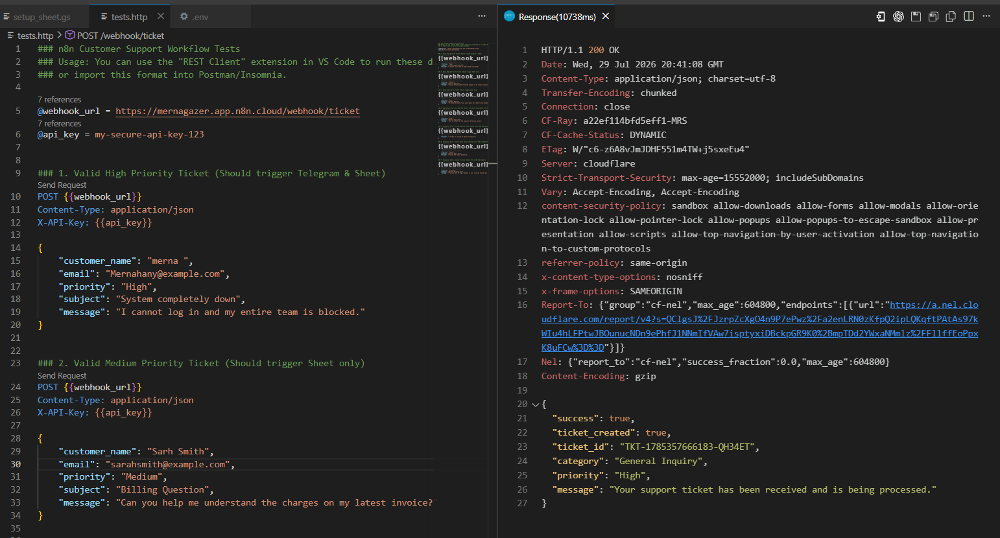
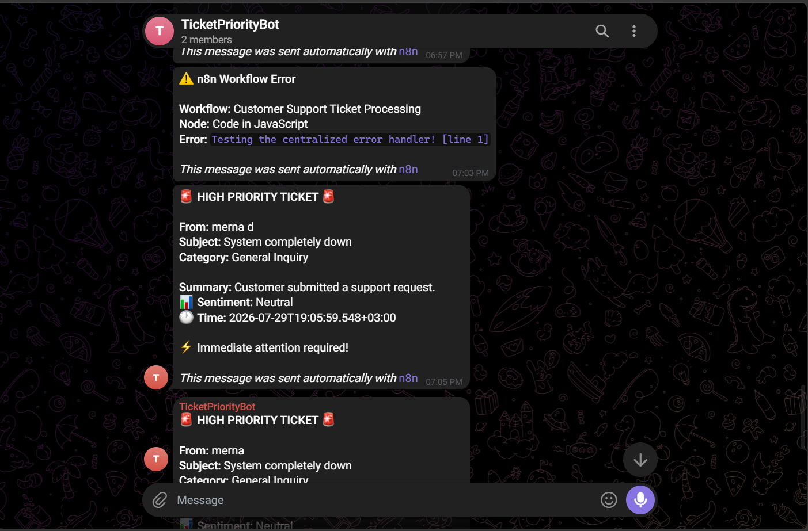
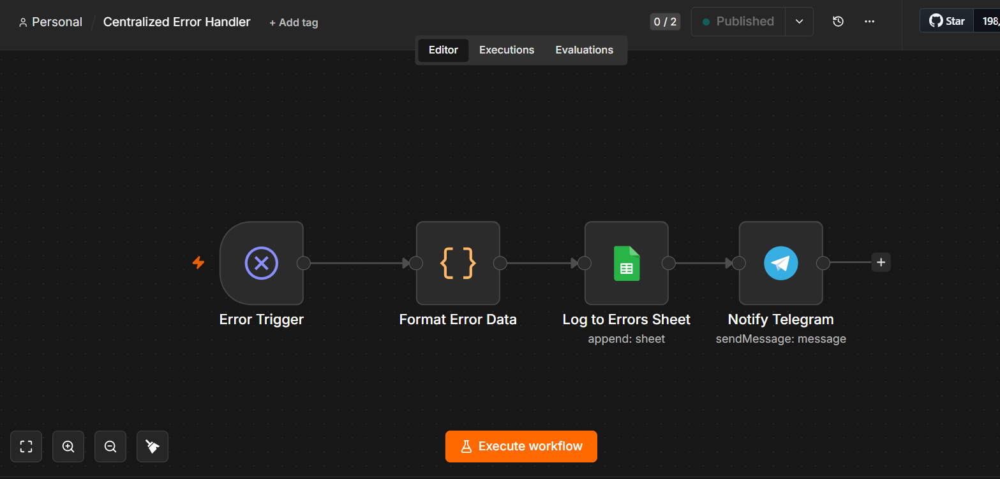

# Customer Support Ticket Automation — n8n Workflow


## Overview

This workflow automates the **end-to-end processing of customer support tickets** submitted via a REST API. It handles validation, AI-powered classification, conditional team notifications, persistent storage, and external system forwarding — all with graceful error handling and no single point of failure.

### What It Does

1. **Receives** a support ticket via POST webhook
2. **Validates** all required fields and data formats
3. **Detects duplicates** to prevent ticket spam
4. **Classifies** the ticket using OpenAI (category, summary, sentiment)
5. **Routes** by priority — sends Telegram alert for High priority tickets
6. **Stores** the complete ticket in Google Sheets
7. **Forwards** to an external API (httpbin.org / configurable)
8. **Returns** a structured JSON response to the caller

## Repository Structure

```text
n8n-support-ticket-automation/
├── assets/                  # 8 execution screenshots
├── README.md                # This documentation file
├── error_workflow.json      # Centralized Error Handler workflow
├── setup_sheet.gs           # Google Apps Script for automated sheet setup
├── tests.http               # Professional REST Client test suite
└── workflow.json            # Main production workflow
```

---

## Execution Evidence & Screenshots

Here is the visual evidence of the workflow correctly executing the required assessment scenarios:

### 1. The Full Workflow Architecture


### 2. Validation Failure (400 Bad Request)
The execution stops immediately if required fields or formats (like email) are invalid.


### 3. Duplicate Detection (409 Conflict)
Bonus Feature: Prevents spam by rejecting identical tickets from the same user within 24 hours.


### 4. Successful Execution (Medium/Low Priority)
Successfully bypasses Telegram, stores in Google Sheets, and forwards to the external API.


### 5. High Priority Execution (Routes to Telegram)
Successfully triggers the Telegram notification path based on conditional logic.



### 6. Notifications & Error Alerts
Live alerts sent to Telegram for High Priority tickets, and fallback alerts for system errors.


### 7. Centralized Error Handler (Bonus)
A separate error handler that gracefully catches and logs any failing nodes across the platform.


---

## Architecture

```
POST /webhook/ticket
        │
        ▼
┌─────────────────────┐
│  Validate Inputs    │──── FAIL ──→ 400 Error Response
│  (Code Node)        │
└─────────────────────┘
        │ PASS
        ▼
┌─────────────────────┐
│  Duplicate Check    │──── DUPLICATE ──→ 409 Conflict Response
│  (Sheets Lookup)    │
└─────────────────────┘
        │ NEW
        ▼
┌─────────────────────┐
│  AI Classification  │
│  (OpenAI HTTP)      │
└─────────────────────┘
        │
        ▼
┌─────────────────────┐
│  Priority Router    │
│  (Switch Node)      │
└─────────────────────┘
    │           │
  High     Medium/Low
    │           │
    ▼           │
┌───────────┐   │
│ Telegram  │   │
│ Notify    │   │
└───────────┘   │
    │           │
    └─────┬─────┘
          │ (Merge)
          ▼
┌─────────────────────┐
│  Prepare Ticket     │
│  (Assign ticket_id) │
└─────────────────────┘
          │
          ▼
┌─────────────────────┐
│  Store to           │
│  Google Sheets      │
└─────────────────────┘
          │
          ▼
┌─────────────────────┐
│  Forward to         │
│  External API       │
└─────────────────────┘
          │
          ▼
┌─────────────────────┐
│  Return Success     │
│  JSON Response      │
└─────────────────────┘
```

---

## Node Reference

| # | Node Name | Type | Purpose |
|---|-----------|------|---------|
| 1 | `Webhook — Receive Ticket` | Webhook | Exposes POST endpoint, defers response to downstream node |
| 2 | `Validate — Input Fields` | Code | Validates required fields, email format, priority enum |
| 3 | `Route — Validation Check` | IF | Branches on validation result |
| 4 | `Respond — Validation Error` | Respond to Webhook | Returns 400 with error details |
| 5 | `Lookup — Recent Tickets` | Google Sheets | Reads existing tickets for duplicate detection |
| 6 | `Check — Duplicate Ticket` | Code | Compares email+subject within 24h window |
| 7 | `Route — Duplicate Check` | IF | Branches on duplicate detection result |
| 8 | `Respond — Duplicate Detected` | Respond to Webhook | Returns 409 Conflict |
| 9 | `AI — Analyze Ticket` | HTTP Request | Calls OpenAI Chat Completions API with JSON mode |
| 10 | `Parse — AI Response` | Code | Validates and normalizes AI output with safe fallbacks |
| 11 | `Route — By Priority` | Switch | Routes High/Medium/Low to appropriate paths |
| 12 | `Notify — Telegram High Priority` | Telegram | Sends formatted HTML message to support team |
| 13 | `Merge — Rejoin After Routing` | Merge | Converges High-priority path back with Medium/Low |
| 14 | `Prepare — Ticket Data` | Code | Assembles final ticket object with generated ticket_id |
| 15 | `Store — Google Sheets` | Google Sheets | Appends ticket row to Tickets sheet (Uses Manual Mapping to prevent breakage if columns are renamed) |
| 16 | `API — Forward Ticket` | HTTP Request | POSTs to external API (postman-echo) with retry logic |
| 17 | `Build — Final Response` | Code | Constructs success response, appends any warnings |
| 18 | `Respond — Success` | Respond to Webhook | Returns 200 with final JSON |

---

## Prerequisites

| Requirement | Details |
|-------------|---------|
| **n8n** | v1.0+ (self-hosted or n8n.cloud) |
| **OpenAI API Key** | GPT-4o-mini or higher recommended |
| **Telegram Bot** | Created via @BotFather |
| **Google Account** | With Google Sheets API access |
| **Google Sheet** | Created with correct column headers (see below) |

---

## Setup Instructions

### Step 1: Create Google Sheet

#### 1a. Create the Spreadsheet

1. Go to [sheets.new](https://sheets.new) to create a blank spreadsheet
2. Rename it: click **"Untitled spreadsheet"** at the top → type **`Support Tickets`** → press Enter
3. Rename the default tab: right-click **"Sheet1"** at the bottom → **Rename** → type **`Tickets`** → press Enter

---

#### 1b. Set Up Column Headers (Row 1)

Click on cell **A1** and enter the following headers exactly — one per column:

| Cell | Header Text | Column Width | Notes |
|------|-------------|-------------|-------|
| A1 | `Ticket ID` | 160 px | Auto-generated by workflow (`TKT-...`) |
| B1 | `Customer Name` | 160 px | From request payload |
| C1 | `Email` | 200 px | From request payload |
| D1 | `Subject` | 240 px | From request payload |
| E1 | `Message` | 300 px | Full message text |
| F1 | `Priority` | 100 px | `High`, `Medium`, or `Low` |
| G1 | `Category` | 160 px | AI-classified category |
| H1 | `Summary` | 280 px | AI-generated one-sentence summary |
| I1 | `Sentiment` | 110 px | `Positive`, `Neutral`, or `Negative` |
| J1 | `Created Date` | 190 px | ISO 8601 timestamp |
| K1 | `Status` | 100 px | Default: `Open` |

**Quick entry tip**: Click A1, type `Ticket ID`, press Tab to move to B1, continue across the row.

---

#### 1c. Format the Header Row

1. **Select row 1**: Click the row number **"1"** on the left margin
2. **Bold**: Press `Ctrl + B`
3. **Background color**: Click the paint bucket icon → choose a dark color (e.g., `#1a1a2e` or `#2d3748`)
4. **Text color**: Click the `A` with color icon → choose White
5. **Freeze row 1**: Menu → **View** → **Freeze** → **1 row** (so headers stay visible when scrolling)
6. **Center-align**: With row 1 still selected, click the Center align button

---

#### 1d. Add Data Validation

Apply dropdown validation so manual entries stay consistent.

**Priority column (F):**
1. Click the column **F** header to select the whole column
2. Menu → **Data** → **Data validation**
3. Click **Add rule**
4. Criteria: **Dropdown** → Add items: `High`, `Medium`, `Low`
5. For invalid data: select **Show a warning**
6. Click **Done**

**Status column (K):**
1. Click the column **K** header
2. Menu → **Data** → **Data validation**
3. Click **Add rule**
4. Criteria: **Dropdown** → Add items: `Open`, `In Progress`, `Resolved`, `Closed`
5. Click **Done**

**Sentiment column (I):**
1. Click column **I**
2. Menu → **Data** → **Data validation**
3. Click **Add rule**
4. Criteria: **Dropdown** → Add items: `Positive`, `Neutral`, `Negative`
5. Click **Done**

---

#### 1e. Add Conditional Formatting (Optional but Professional)

Make Priority cells color-coded automatically:

1. Select column **F** → Menu → **Format** → **Conditional formatting**
2. Add 3 rules:

| Rule | Condition | Format |
|------|-----------|--------|
| Rule 1 | Text is exactly `High` | Background: Red `#f44336`, Bold |
| Rule 2 | Text is exactly `Medium` | Background: Orange `#ff9800` |
| Rule 3 | Text is exactly `Low` | Background: Green `#4caf50` |

Do the same for column **I** (Sentiment):

| Rule | Condition | Format |
|------|-----------|--------|
| Rule 1 | Text is exactly `Negative` | Background: `#ffcdd2` |
| Rule 2 | Text is exactly `Neutral` | Background: `#fff9c4` |
| Rule 3 | Text is exactly `Positive` | Background: `#c8e6c9` |

---

#### 1f. (Optional) Auto-Setup via Google Apps Script

Instead of manual setup, paste this script to create everything automatically:

1. In your spreadsheet: **Extensions** → **Apps Script**
2. Delete any existing code and paste the following:

```javascript
function setupTicketsSheet() {
  const ss = SpreadsheetApp.getActiveSpreadsheet();

  // Create or get the Tickets sheet
  let sheet = ss.getSheetByName('Tickets');
  if (!sheet) {
    sheet = ss.insertSheet('Tickets');
  } else {
    sheet.clear();
  }

  // --- HEADERS ---
  const headers = [
    'Ticket ID', 'Customer Name', 'Email', 'Subject', 'Message',
    'Priority', 'Category', 'Summary', 'Sentiment', 'Created Date', 'Status'
  ];
  const headerRange = sheet.getRange(1, 1, 1, headers.length);
  headerRange.setValues([headers]);

  // Header styling
  headerRange.setFontWeight('bold');
  headerRange.setFontColor('#FFFFFF');
  headerRange.setBackground('#1a1a2e');
  headerRange.setHorizontalAlignment('center');
  headerRange.setFontSize(11);

  // --- COLUMN WIDTHS ---
  const widths = [160, 160, 200, 240, 300, 100, 160, 280, 110, 190, 100];
  widths.forEach((w, i) => sheet.setColumnWidth(i + 1, w));

  // --- FREEZE HEADER ROW ---
  sheet.setFrozenRows(1);

  // --- ROW HEIGHT for header ---
  sheet.setRowHeight(1, 35);

  // --- DATA VALIDATION: Priority (col 6) ---
  const priorityRule = SpreadsheetApp.newDataValidation()
    .requireValueInList(['High', 'Medium', 'Low'], true)
    .setAllowInvalid(false)
    .setHelpText('Must be High, Medium, or Low')
    .build();
  sheet.getRange(2, 6, 999, 1).setDataValidation(priorityRule);

  // --- DATA VALIDATION: Status (col 11) ---
  const statusRule = SpreadsheetApp.newDataValidation()
    .requireValueInList(['Open', 'In Progress', 'Resolved', 'Closed'], true)
    .setAllowInvalid(false)
    .build();
  sheet.getRange(2, 11, 999, 1).setDataValidation(statusRule);

  // --- DATA VALIDATION: Sentiment (col 9) ---
  const sentimentRule = SpreadsheetApp.newDataValidation()
    .requireValueInList(['Positive', 'Neutral', 'Negative'], true)
    .setAllowInvalid(false)
    .build();
  sheet.getRange(2, 9, 999, 1).setDataValidation(sentimentRule);

  // --- CONDITIONAL FORMATTING: Priority ---
  const priorityRange = sheet.getRange('F2:F1000');
  const rules = sheet.getConditionalFormatRules();

  rules.push(SpreadsheetApp.newConditionalFormatRule()
    .whenTextEqualTo('High')
    .setBackground('#f44336').setFontColor('#ffffff').setBold(true)
    .setRanges([priorityRange]).build());

  rules.push(SpreadsheetApp.newConditionalFormatRule()
    .whenTextEqualTo('Medium')
    .setBackground('#ff9800').setFontColor('#ffffff')
    .setRanges([priorityRange]).build());

  rules.push(SpreadsheetApp.newConditionalFormatRule()
    .whenTextEqualTo('Low')
    .setBackground('#4caf50').setFontColor('#ffffff')
    .setRanges([priorityRange]).build());

  // --- CONDITIONAL FORMATTING: Sentiment ---
  const sentimentRange = sheet.getRange('I2:I1000');

  rules.push(SpreadsheetApp.newConditionalFormatRule()
    .whenTextEqualTo('Negative')
    .setBackground('#ffcdd2').setFontColor('#b71c1c')
    .setRanges([sentimentRange]).build());

  rules.push(SpreadsheetApp.newConditionalFormatRule()
    .whenTextEqualTo('Neutral')
    .setBackground('#fff9c4').setFontColor('#f57f17')
    .setRanges([sentimentRange]).build());

  rules.push(SpreadsheetApp.newConditionalFormatRule()
    .whenTextEqualTo('Positive')
    .setBackground('#c8e6c9').setFontColor('#1b5e20')
    .setRanges([sentimentRange]).build());

  sheet.setConditionalFormatRules(rules);

  // --- BORDER on header ---
  headerRange.setBorder(
    true, true, true, true, true, true,
    '#333333', SpreadsheetApp.BorderStyle.SOLID_MEDIUM
  );

  // Enable text wrapping on Message and Summary columns
  sheet.getRange('E2:E1000').setWrap(true);
  sheet.getRange('H2:H1000').setWrap(true);

  // Set alternating row colors for data rows
  const dataRange = sheet.getRange(2, 1, 999, headers.length);
  dataRange.applyRowBanding(SpreadsheetApp.BandingTheme.LIGHT_GREY);

  SpreadsheetApp.getUi().alert(
    '✅ Tickets sheet has been set up successfully!\n\n' +
    'Sheet: Tickets\n' +
    'Columns: ' + headers.length + '\n' +
    'Validation: Priority, Status, Sentiment\n' +
    'Formatting: Applied\n\n' +
    'Copy the Spreadsheet ID from the URL and paste it into your n8n environment variable GOOGLE_SHEET_ID.'
  );
}
```

3. Click **Save** (disk icon), then click **Run**
4. Authorize the script when prompted (it only accesses your spreadsheet)
5. When complete, you'll see a success dialog

---

#### 1g. Copy the Spreadsheet ID

From the browser URL bar:

```
https://docs.google.com/spreadsheets/d/1BxiMVs0XRA5nFMdKvBdBZjgmUUqptlbs74OgVE2upms/edit
                                        ↑────────────────────────────────────────────↑
                                        This entire string is your SPREADSHEET_ID
```

Save this ID, you will need it in Step 5.

> **Important**: Also create a second tab named **`Errors`** (right-click the Tickets tab → Insert sheet → name it `Errors`) with columns: `Timestamp`, `Workflow`, `Node`, `Error Message`, `Input Data`. This is used by the Centralized Error Workflow.

---

### Step 2: Create Telegram Bot

1. Open Telegram and search for **@BotFather**
2. Send `/newbot` and follow the prompts
3. Copy the **Bot Token** (format: `1234567890:ABCdef...`)
4. Create a group or channel and add your bot as admin
5. Get your **Chat ID**:
   ```
   https://api.telegram.org/bot<YOUR_BOT_TOKEN>/getUpdates
   ```
   Send a message in the group, then look for `"chat":{"id": -1001234567890}` in the response.

---

### Step 3: Get OpenAI API Key

1. Go to [platform.openai.com](https://platform.openai.com)
2. Navigate to **API Keys** → **Create new secret key**
3. Copy the key (starts with `sk-...`)
4. Ensure your account has GPT-4o-mini access

---

### Step 4: Configure n8n Credentials

In n8n, go to **Settings → Credentials** and add the following:

#### 1. Google API (Service Account)
Using a Service Account is the production-ready way to authenticate.
1. Go to Google Cloud Console and create a Service Account
2. Generate a JSON Key for the Service Account
3. Copy the Service Account email address
4. Share your Google Sheet with that email address (give it Editor access)
5. In n8n, create a new **Google API** credential
6. Paste the Service Account Email and the Private Key from your JSON file

#### 2. Telegram Bot API
- Credential type: `Telegram API`
- Paste your Bot Token

#### 3. OpenAI API
- Credential type: `OpenAI API`
- Paste your OpenAI Secret Key (starts with `sk-...`)
- Ensure your account has access to the `gpt-4o-mini` model

---

### Step 5: Configure UI Variables

> **Why use n8n UI Variables?**
> Hardcoding configuration (like Spreadsheet IDs or Chat IDs) directly into workflow nodes makes the workflow difficult to maintain. By using n8n's built-in **Variables** (`$vars`), non-technical managers can update configuration values safely from the n8n Settings dashboard without needing to edit the workflow nodes or touch server files.

1. Open n8n and click on **Settings** (gear icon in the left menu)
2. Click on **Variables**
3. Add the following variables exactly as named:

| Name | Type | Value (Example) | Description |
|------|------|-----------------|-------------|
| `GOOGLE_SHEET_ID` | String | `1BxiMVs0XRA5nFMdKvBdB...` | The ID from your Google Sheet URL |
| `TELEGRAM_CHAT_ID` | String | `-1001234567890` | Your Telegram group/chat ID |
| `EXTERNAL_API_URL` | String | `http://postman-echo.com/post` | Target URL for ticket forwarding |
| `AI_MODEL` | String | `gpt-4o-mini` | OpenAI model to use for classification |

---

### Step 6: Import Workflow

1. Open n8n → **Workflows** → **Import from file**
2. Select `workflow.json`
3. **Important**: Open the newly imported workflow and verify the Credentials:
   - Double-click node **15 (Store — Google Sheets)** and ensure your Google API credential is selected.
   - Double-click node **12 (Notify — Telegram)** and ensure your Telegram API credential is selected.
   - Double-click node **9 (AI — Analyze Ticket)** and ensure your OpenAI credential is selected.
4. **Activate** the workflow (toggle in the top right)

---

### Step 7: Test the Webhook

```bash
# Test: Valid High Priority ticket
curl -X POST http://localhost:5678/webhook/ticket \
  -H "Content-Type: application/json" \
  -d '{
    "customer_name": "Ahmed Ali",
    "email": "ahmed@example.com",
    "priority": "High",
    "subject": "Unable to Login",
    "message": "I cannot access my account after changing my password."
  }'

# Test: Validation failure (missing field)
curl -X POST http://localhost:5678/webhook/ticket \
  -H "Content-Type: application/json" \
  -d '{
    "customer_name": "Ahmed Ali",
    "priority": "High"
  }'

# Test: Invalid priority
curl -X POST http://localhost:5678/webhook/ticket \
  -H "Content-Type: application/json" \
  -d '{
    "customer_name": "Ahmed Ali",
    "email": "ahmed@example.com",
    "priority": "Critical",
    "subject": "Broken feature",
    "message": "The export button does not work."
  }'
```

---

## API Reference

### Endpoint

```
POST /webhook/ticket
Content-Type: application/json
```

### Request Payload

```json
{
  "customer_name": "Ahmed Ali",
  "email": "ahmed@example.com",
  "priority": "High",
  "subject": "Unable to Login",
  "message": "I cannot access my account after changing my password."
}
```

### Field Validation Rules

| Field | Required | Validation |
|-------|----------|------------|
| `customer_name` | ✅ | Non-empty string |
| `email` | ✅ | Valid email format (`user@domain.tld`) |
| `subject` | ✅ | Non-empty string |
| `message` | ✅ | Non-empty string |
| `priority` | ✅ | Must be exactly: `High`, `Medium`, or `Low` |

### Response Examples

#### ✅ Success (200)
```json
{
  "success": true,
  "ticket_created": true,
  "ticket_id": "TKT-1722254400000-AB3X7Y",
  "category": "Technical Issue",
  "priority": "High",
  "message": "Your support ticket has been received and is being processed."
}
```

#### ❌ Validation Error (400)
```json
{
  "success": false,
  "message": "Invalid request.",
  "errors": ["Missing required field: email", "Invalid priority. Must be one of: High, Medium, Low"]
}
```

#### ⚠️ Duplicate Ticket (409)
```json
{
  "success": false,
  "message": "Duplicate ticket detected. A similar ticket was submitted within the last 24 hours.",
  "ticket_created": false
}
```

#### ✅ Success with warnings (200)
```json
{
  "success": true,
  "ticket_created": true,
  "ticket_id": "TKT-1722254400000-CD9F2K",
  "category": "Billing",
  "priority": "Medium",
  "message": "Your support ticket has been received and is being processed.",
  "warnings": ["External API forwarding failed — ticket still created locally."]
}
```

---

## Design Decisions

### Why `Respond to Webhook` instead of direct webhook response?
This pattern gives full control over response timing, status codes, and body at any point in the workflow — including after async operations complete. It also enables different response shapes for different paths (400, 409, 200).

### Why a single Code node for validation instead of multiple IF nodes?
A single Code node returns **all validation errors at once**, is more maintainable, and follows the DRY principle. Chained IF nodes would force users to fix one error at a time.

### Why a Switch node for priority routing instead of IF?
Switch is semantically correct for exhaustive multi-branch routing. It's also more extensible — adding `Critical` or `Emergency` priority only requires adding a new case, not restructuring the graph.

### Why a Merge node after Telegram?
Without Merge, the storage/response nodes would need to be duplicated for the High-priority path. Merge converges both paths into a single continuation, eliminating duplicated logic.

### Why a dedicated `Prepare — Ticket Data` Code node?
Decoupling data assembly from storage means switching backends (Sheets → PostgreSQL) requires changing only two nodes, not rebuilding the whole downstream graph.

### Why HTTP Request for OpenAI instead of the native OpenAI node?
The HTTP Request approach is more educational (demonstrates API knowledge), more portable (works with any OpenAI-compatible API), and explicitly shows the JSON mode parameter — demonstrating understanding of structured output.

---

## Assumptions

1. **Priority is case-sensitive**: `High`, `Medium`, `Low` (not `HIGH` or `high`). The workflow follows the spec exactly.
2. **Google Sheets as primary storage**: Chosen for simplicity and zero-infrastructure setup. Production would use PostgreSQL.
3. **Duplicate detection is best-effort**: If the Google Sheets lookup fails (network error), the workflow continues without blocking ticket creation — availability over consistency.
4. **Manual Data Mapping**: In the Google Sheets node, columns are mapped manually (`mappingMode: defineBelow`) rather than `autoMapInputData`. This is a senior-level best practice that decouples the workflow from the database schema. If a user renames the spreadsheet column from "Customer Name" to "Client Name", auto-mapping would instantly break and lose data, whereas manual mapping continues to work flawlessly.
5. **AI fallback values**: If OpenAI is unavailable, the ticket is still created with `category: "General Inquiry"` and `summary: "Customer submitted a support request."`.
6. **Ticket ID format**: `TKT-{timestamp}-{random}` is human-readable and sortable. A UUID would be more collision-proof for high-volume systems.

---

## Security
The Webhook is protected using **Header Authentication**.
All incoming requests must provide an `X-API-Key` header, preventing spam and unauthorized ticket creation.

---

## Limitations

1. **Google Sheets scalability**: Sheets degrades past ~50,000 rows. Migrate to PostgreSQL for production volume.
2. **Duplicate detection scope**: Only checks same `email + subject` within 24 hours. Different subject with same issue would create a new ticket.
3. **Telegram only**: Notification is Telegram-only. Production would support PagerDuty, Slack, or email as alternatives.
4. **Single environment**: No staging/production separation via n8n environment variables currently.
5. **No ticket status updates**: Workflow only creates tickets. A separate workflow would handle updates, assignments, and resolutions.

---

## Error Handling

### Strategy: Fail-safe with meaningful responses

All integration nodes (`Lookup — Recent Tickets`, `AI — Analyze Ticket`, `Notify — Telegram`, `Store — Google Sheets`, `API — Forward Ticket`) have **Continue on Fail** enabled.

This means:
- A Telegram failure does **not** prevent the ticket from being stored
- A Google Sheets outage does **not** crash the workflow
- All failures are captured in the `warnings` array of the response

### Centralized Error Workflow

A separate **Error Handler** workflow is referenced in the main workflow settings. It catches unhandled execution failures and:
1. Logs the error details to a dedicated `Errors` sheet
2. Notifies the admin via Telegram

### Retry Logic

| Node | Retries | Delay |
|------|---------|-------|
| `AI — Analyze Ticket` | 3 | 2000ms |
| `API — Forward Ticket` | 3 | 1000ms |

---

## Bonus Features Implemented

| Feature | Implementation |
|---------|---------------|
| ✅ Duplicate ticket detection | Google Sheets lookup checks if exact Email + Subject was previously submitted |
| ✅ Retry failed HTTP requests | 3 retries on AI and External API nodes |
| ✅ Centralized Error Workflow | Referenced in workflow settings |
| ✅ Environment variables | All credentials and IDs via `$env.*` expressions |


